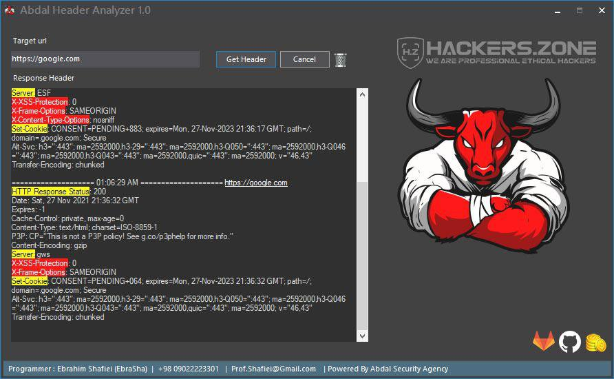

# Abdal Header Analyzer

****

## Screenshot

## Made For

Abdal Header Analyzer is a software for analyzing site and web server headers. As you know, headers contain information that security experts and hackers use to analyze targets.

**Requires**
> Visual Studio 2019 - Telerik WinForm - Chilkat - .NetFramework 4.7.*
>

Features

- Identify security headers
- Identify servers and applications
- Zero Fault
- Beautiful appearance
- Has an installation package
- No malware
- Open Source
- high speed

## Donation
> Donate link: https://donate.abdalagency.ir/

## Reporting Issues

If you are facing a configuration issue or something is not working as you expected to be, please use the **Abdal.Group@Gmail.Com** or **Prof.Shafiei@Gmail.com** . Issues on GitLab are also welcomed.

### About Programmer
Ebrahim Shafiei (EbraSha) (Ready to cooperate with international projects)
- Email : Prof.Shafiei@Gmail.com

## License
Abdal Header Analyzer is open-source software licensed under the [MIT license.](https://choosealicense.com/licenses/mit/)

## ⚠️ Legal disclaimer ⚠️

Usage of Abdal Header Analyzer for attacking targets without prior mutual consent is illegal. It's the end user's responsibility to obey all applicable local, state and federal laws. Developers assume no liability and are not responsible for any misuse or damage caused by this program.

